# 101 Step Functions - Infinity Works

This is the 101 on Step Functions, this course will introduce you to step functions and some of the features that make them so great.

Step Functions allow you to generate worflows that co-ordinate Lambdas.  
The Lambdas can be written in any supported language, and don't event need to be the same language.

Step functions have many useful features, they start a state for each execution, this state is accesible in each step, steps can modify the state.

The workflows have ability to retry failed Lambda steps, sleep, wait, and many other useful features.

>Why Serverless.com? : Serverless makes building deploying and managing all the moving parts (such as Roles, Permissions, Lambdas) much simpler.  This helps us focus on the step machines, not the `AWS stuff` needed to deploy and run them. AWS have a similar product called AWS SAM (Serverless Application Model) <https://docs.aws.amazon.com/serverless-application-model/latest/developerguide/what-is-sam.html>

## Outline

* Setup the software
* AWS CLI
* Setting up the project
* The first Step Function : 101WaitMachine
* Next Step Function : 101HelloMachine
* Next Step Function : 101FlakeyMachine
* Next Step Function : 101ParallelMachine
* Next Step Function : 101ChoiceMachine

## Setup software

Check to see you have `NPM` and `NODE` installed

```bash
node -v
v8.10.0
```

```bash
npm -v
6.8.0
```

### Install nodejs

_Linux_

```bash
 sudo apt install nodejs
 ```

 _macOS and Windows_

 <https://nodejs.org/en/download/>

### Install serverless

```bash
npm install --save-dev serverless
```

Check the version

```bash
sls -version
1.36.3
```

> if you have problems running sls you can try a global install with `npm install -g serverless`

## Install AWS CLI

Aws cli allows you run run commands on your computer to interact directly with your AWS Account.

<https://docs.aws.amazon.com/cli/latest/userguide/cli-chap-install.html>

Create a Programmtaical `IAM User`, and add a profile for the AWS CLI to use

### BUG Serverless only reads from .aws/credentials

See <https://github.com/serverless/serverless/issues/3833>

This is not normal but instead of a `[profile 101profile]` in ~/.aws/config

It must be in `~/.aws/credentials`

```bash
[101profile]
source_profile = iw-stevenharper
role_arn       = arn:aws:iam::455073406672:role/OrganizationAccountAccessRole
```

```bash
[101profile]
aws_access_key_id     = YYYYYYYYYYYYYYYY
aws_secret_access_key = XXXXXXXXXXXXXXXXXX
```

## Joining this project 

If  you don't want to setup from scratch, you can just prepare to build with

```bash
npm install
npm install serverless
npm install --save-dev serverless-step-functions
```

### Install the Go extension in Visual Code 

- CTRL+SHIFT+P
- Go: Install/Update tools
- Check all the boxes 
- Okay

## Setting up the Serverless project

<https://serverless.com>

<https://serverless.com/framework/docs/providers/aws/cli-reference/create/>

In your project directory run the serverless step functions setup

```bash
cd 101
serverless create --template aws-nodejs --name iw-101-stepfunctions-nodejs
```

```bash
Serverless: Generating boilerplate...
 _______                             __
|   _   .-----.----.--.--.-----.----|  .-----.-----.-----.
|   |___|  -__|   _|  |  |  -__|   _|  |  -__|__ --|__ --|
|____   |_____|__|  \___/|_____|__| |__|_____|_____|_____|
|   |   |             The Serverless Application Framework
|       |                           serverless.com, v1.36.3
 -------'

Serverless: Successfully generated boilerplate for template: "aws-nodejs"
```

This creates you a project structure : see [./saved-steps/serverless-01-generated-example.yml](./saved-steps/serverless-01-generated-example.yml)

- 1 nodejs handler : `hello`
- `.gitignore`
- `serverless.yml` main file

Next we need to install the `step-functions` plugin.

```bash
npm install --save-dev serverless-step-functions
```

```bash
+ serverless-step-functions@2.10.1
added 606 packages from 366 contributors and audited 1820 packages in 29.587s
found 0 vulnerabilities
```

This runs, and pulls down all the npm packages and their dependancies

This `package-lock.json` file pins your dependancies to the current versions, deleting it or alerting it will cause versions to change/update.

The `node_modules` folder is transient and should not be checked in, add the following to the `.gitignore`

```bash
# node_modules
node_modules
```

Lets generate a `package.json`, just accept all the defaults

```bash
npm init
```

next we need to add the plugins section to the `serverless.yml`

```yaml
plugins:
  - serverless-step-functions
```

and lets add `stage: dev` and `region: eu-west-1` to the provider section

```yaml
provider:
  name: aws
  runtime: nodejs8.10
  stage: dev
  region: eu-west-1
```

While we are here a general cleanup of the `serverless.yaml` file is needed, lets clear out what we don't want: see [./saved-steps/serverless-01-cut-down.yml](./saved-steps/serverless-01-cut-down.yml)


## The first Step Function : 101WaitMachine

Lets modify our `serverless.yml` and add a Step Function called `101WaitMachine`.

This Step Function will not even use a Lambda, it will simply use some of the features of State Machines to implement a workflow.

>_NOTE_ : we have added a `profile: 101profile` to the serverless.yml, this needs to be a valid working AWS CLI profile.

Test you AWS CLI profile with:

```bash
aws s3 ls --profile 101profile
```

When you start an execution, 2 steps occur, each with a set wait time : see [./saved-steps/serverless-02-101-wait-machine.yml](./saved-steps/serverless-02-101-wait-machine.yml) 

### Deployment of the 101WaitMachine

First, lets just use serverless to build the code locally

```bash
sls package
```

```bash
Serverless: Packaging service...
```

A collection of `cloudformation` has been generated in `.serverless/*`

So it's time to actually deploy this:

```bash
sls deploy --verbose stage=dev
```

### What happened?

> Cloudformation was created, copied to S3 and run out

<https://eu-west-1.console.aws.amazon.com/cloudformation/home?region=eu-west-1>

> This created a lot of things, including a StepFunction

<https://eu-west-1.console.aws.amazon.com/states/home?region=eu-west-1#/statemachines>

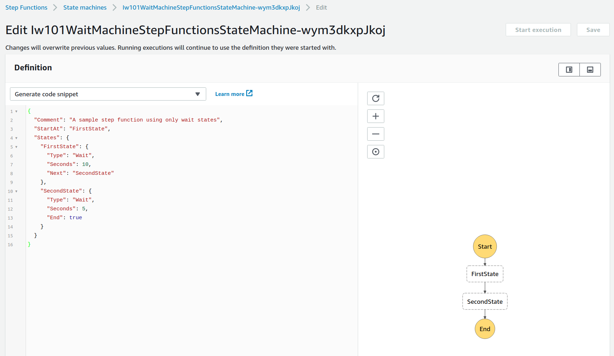

Great - lets run one, click the `execute button` and just leave the defaults and click `Start execution`


## Next Step Function : 101HelloMachine

Ok, great now lets do something useful : lets store some information in state

Lets rename the handler.js to [./hello.js](./hello.js) file to make it work with step function events.

```javascript
'use strict';

module.exports.handler = (event, context, callback) => {

  var comment = event.Comment;

  console.log(JSON.stringify(event));
  console.log(JSON.stringify(context));

  var result = {
    message : 'Hello 101 Class ' + comment,
    memory : context.memoryLimitInMB,
    functionName : context.functionName,
    invokeId : context.invokeid
  };
  callback(null, result);

};
```

Now lets insert this step into our state machine see [./saved-steps/serverless-03-101-hello-machine.yml](./saved-steps/serverless-03-101-hello-machine.yml) 

```yml
          SecondState:
            Type: Task
            Resource:
              Fn::GetAtt: [hello, Arn]
            Next: ThirdState
            ResultPath: "$.taskresult"
          ThirdState:
            Type: Wait
            Seconds: 5
            End: true
```

Also lets improve the function, and reduce its available memory (saves money)

```yml
functions:
  hello:
    handler: handler.hello
    description: A Lambda that says hello
    memorySize: 128
    timeout: 2
```

and deploy it

```bash
sls deploy --verbose stage=dev
```

You can now see the new Lambda <https://eu-west-1.console.aws.amazon.com/lambda/home?region=eu-west-1#/functions/iw-101-stepfunctions-nodejs-dev-hello?tab=configuration>

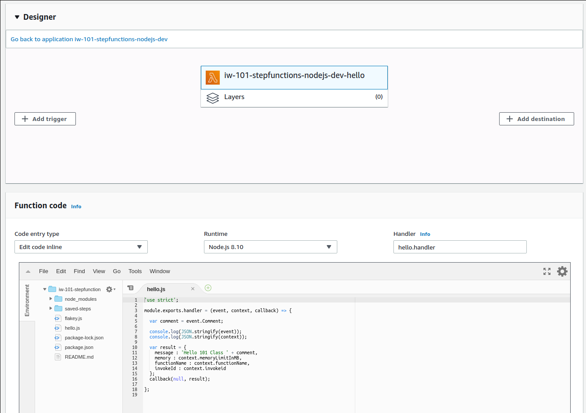

So that worked : lets test it with a dummy event

```json
{
  "Comment": "Insert your JSON here"
}
```

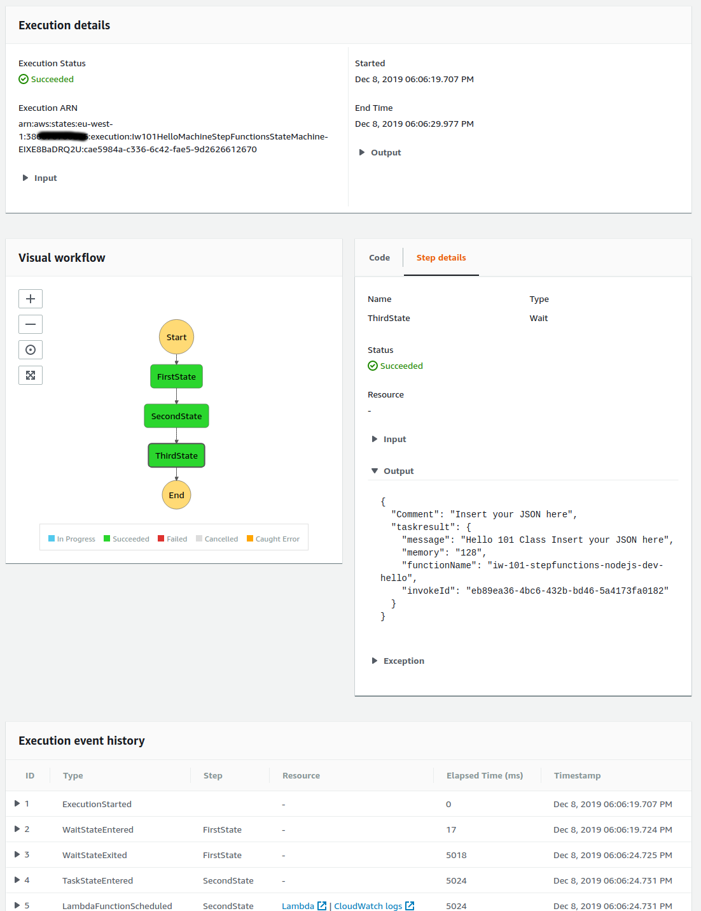

Great it outputted

```json
{
  "Comment": "Insert your JSON here",
  "taskresult": {
    "message": "Hello 101 Class Insert your JSON here",
    "memory": "128",
    "functionName": "iw-101-stepfunctions-nodejs-dev-hello",
    "invokeId": "eb89ea36-4bc6-432b-bd46-5a4173fa0182"
  }
}
```

If we check the cloudwatch logs, then we can see the 2 `Console.log` items

Event

```json
{
    "Comment": "Insert your JSON here"
}
```

Context

```json
{
    "callbackWaitsForEmptyEventLoop": true,
    "logGroupName": "/aws/lambda/iw-101-stepfunctions-nodejs-dev-hello",
    "logStreamName": "2019/12/08/[$LATEST]8eda7350ce124b1a945cf3e909a31a00",
    "functionName": "iw-101-stepfunctions-nodejs-dev-hello",
    "memoryLimitInMB": "128",
    "functionVersion": "$LATEST",
    "invokeid": "f1f6ccc2-e58c-4603-b155-5420368d608e",
    "awsRequestId": "f1f6ccc2-e58c-4603-b155-5420368d608e",
    "invokedFunctionArn": "arn:aws:lambda:eu-west-1:REDACTED:function:iw-101-stepfunctions-nodejs-dev-hello"
}
```

## Next Step Function : 101FlakeyMachine

Now lets see how we can deal with errors - retry, backoff, and failures

This `serverless.yml` is the next example [./saved-steps/serverless-04-101-flakey-machine.yml](./saved-steps/serverless-04-101-flakey-machine.yml) 

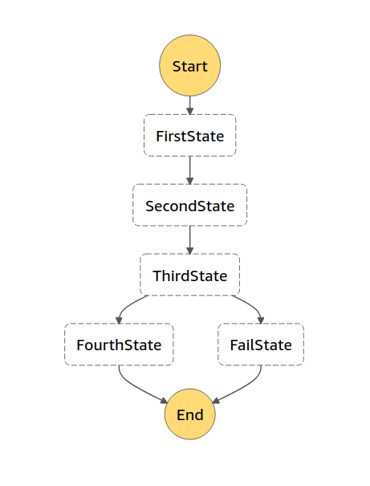

It uses the [./flakey.js](./flakey.js) file.

In this file, the main function will generate random failures, see the custom error?

```javascript
'use strict';

module.exports.handler = (event, context, callback) => {

  function CustomError(message) {
    this.name = 'CustomError';
    this.message = message;
  }
  CustomError.prototype = new Error();

  var min = 1;
  var max = 100;    
  var randomNumber = Math.floor(Math.random() * (max - min + 1)) + min;

  console.log("generatedRandom : " + randomNumber);

  if (randomNumber < 51) {
    callback(new CustomError('bad stuff happened...'));
  }
  if (randomNumber < 91) {
    callback(new Error('something went wrong'));
  }
  callback(null, "Super Happy Success");

};
```

The custom error lets you have different control in your step function, depending on what error occured

The errors can be trapped, and retry the lambda.
Retries, can be instructed to back-off (leave longer gaps), if they continue to fail.

```yml
          ThirdState:
            Type: Task
            Resource:
              Fn::GetAtt: [flakey, Arn]
            Next: FourthState
            ResultPath: "$.flakeyresult"
            Retry:
            - ErrorEquals:
              - States.ALL
              IntervalSeconds: 5
              MaxAttempts: 5
              BackoffRate: 2
            Catch:
            - ErrorEquals:
              - States.ALL
              Next : FailState
```

Once it runs out of retries, the Catch is activated.  This leads is to a `Type : Fail`

```yaml
          FailState:
            Type: Fail
            Cause: "randomness didn't generate a number > 90"
```

Lets deploy this to give it a go.

```bash
sls deploy --verbose stage=dev
```

So that worked : lets test it with a few dummy events

```json
{
  "Comment": "Insert your JSON here"
}
```

So here is one that failed

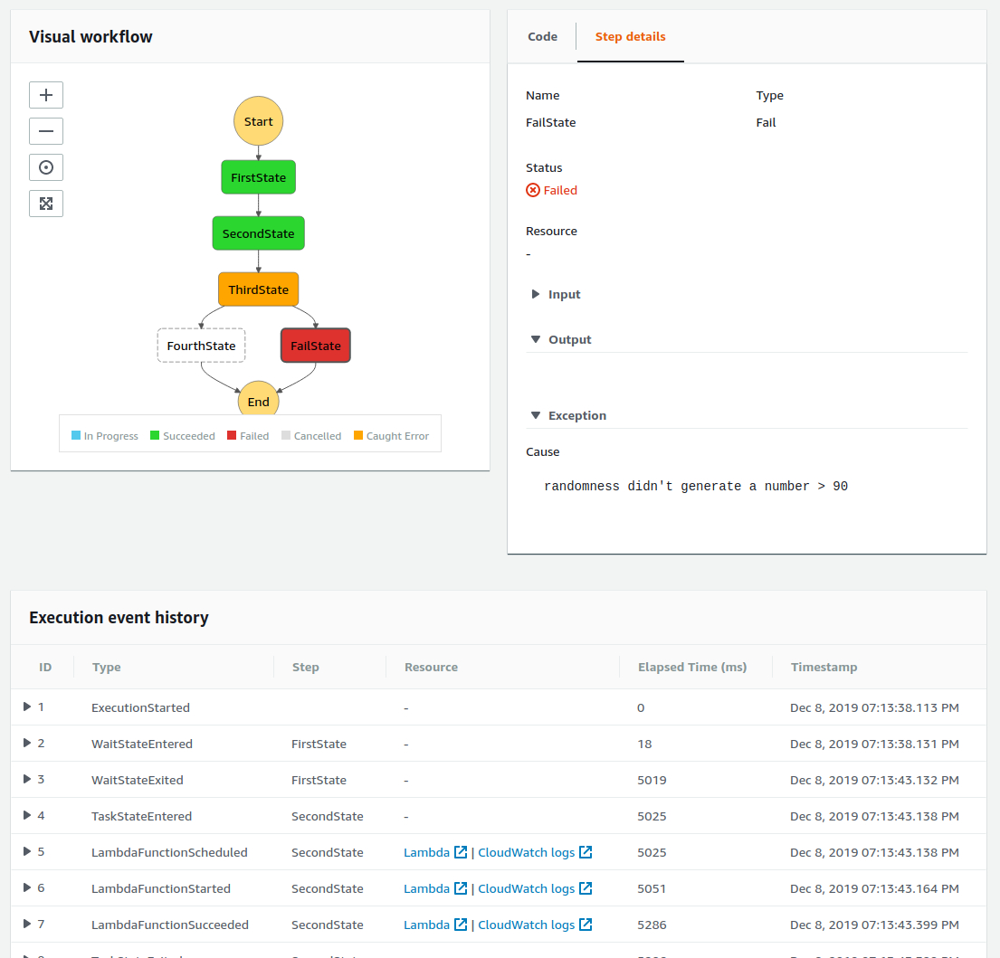

And one that succeeded

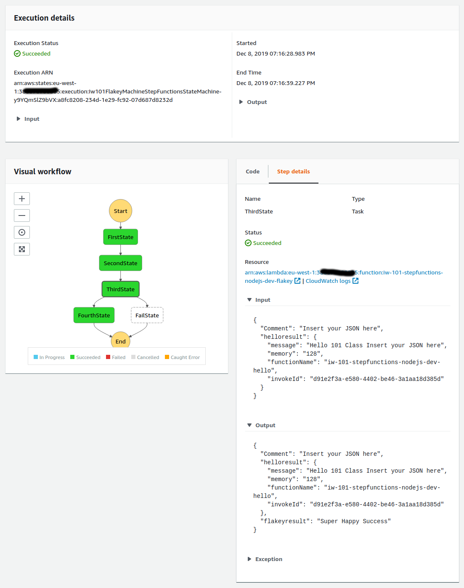

The successful execution still needed a few retries and had errors

```json
{
  "error": "CustomError",
  "cause": {
    "errorMessage": "bad stuff happened...",
    "errorType": "CustomError",
    "stackTrace": [
      "module.exports.handler (/var/task/flakey.js:9:27)"
    ]
  }
}
```

and

```json
{
  "error": "Error",
  "cause": {
    "errorMessage": "something went wrong",
    "errorType": "Error",
    "stackTrace": [
      "module.exports.handler (/var/task/flakey.js:21:14)"
    ]
  }
}
```

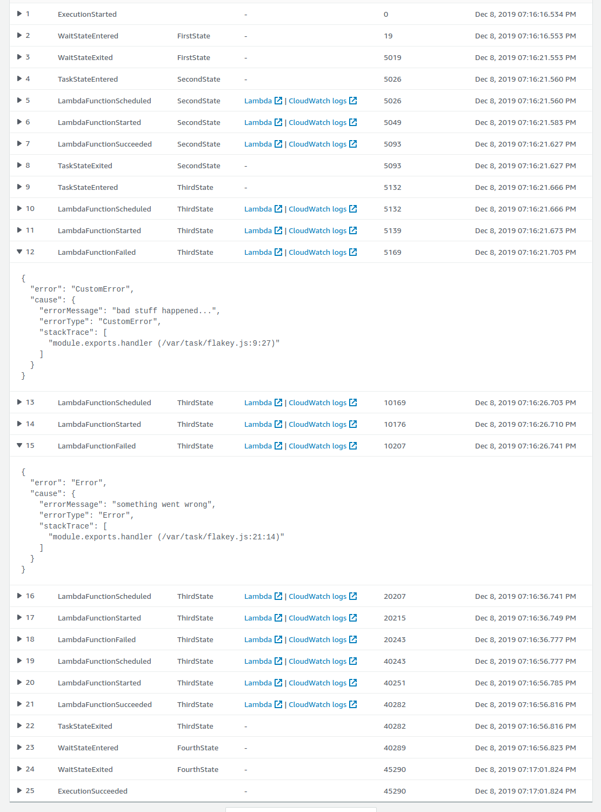

Here we can see a list of executions

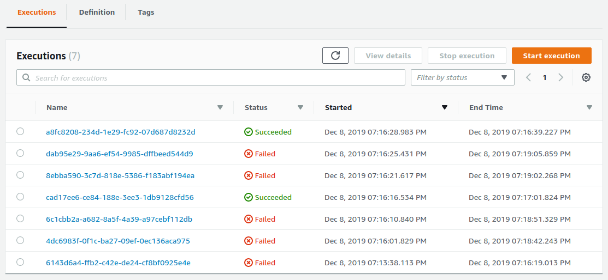

## Next Step Function : 101ParallelMachine

This `serverless.yml` is the next example [./saved-steps/serverless-05-101-parallel-machine.yml](./saved-steps/serverless-05-101-parallel-machine.yml)

This machine will use the `Type : Parallel` to run Steps in Parallel.

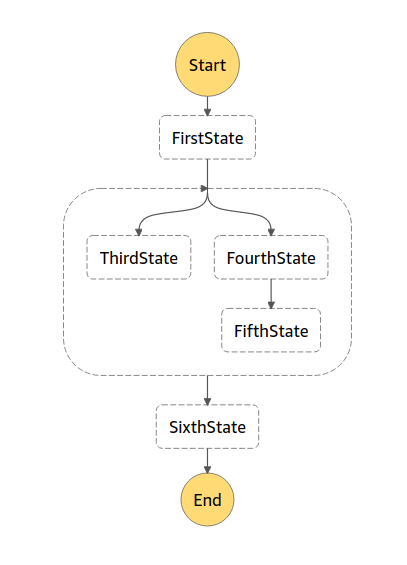

The `Branches:` part is where it starts, each branch is executed and follows through the steps defined in the the `inner States`.
Each branch finishes with it's own `End: true`

```yml
            Branches:
            - StartAt: ThirdState
              States:
                ThirdState:
                  Type: Task
                  Resource:
                    Fn::GetAtt: [hello, Arn]
                  End: true
                  ResultPath: "$.helloresult"
            - StartAt: FourthState
              States:
                FourthState:
                  Type: Wait
                  Seconds: 5
                  Next: FifthState
                FifthState:
                  Type: Task
                  Resource:
                    Fn::GetAtt: [hello, Arn]
                  End: true
                  ResultPath: "$.helloresult2"
```

As these state machines get more complex you may want to turn on debugging to get more details as you try to deploy or package, to do this export a variable.

```bash
export SLS_DEBUG=*
```

And deploy it.

```bash
sls deploy --verbose stage=dev
```

Now lets run one!

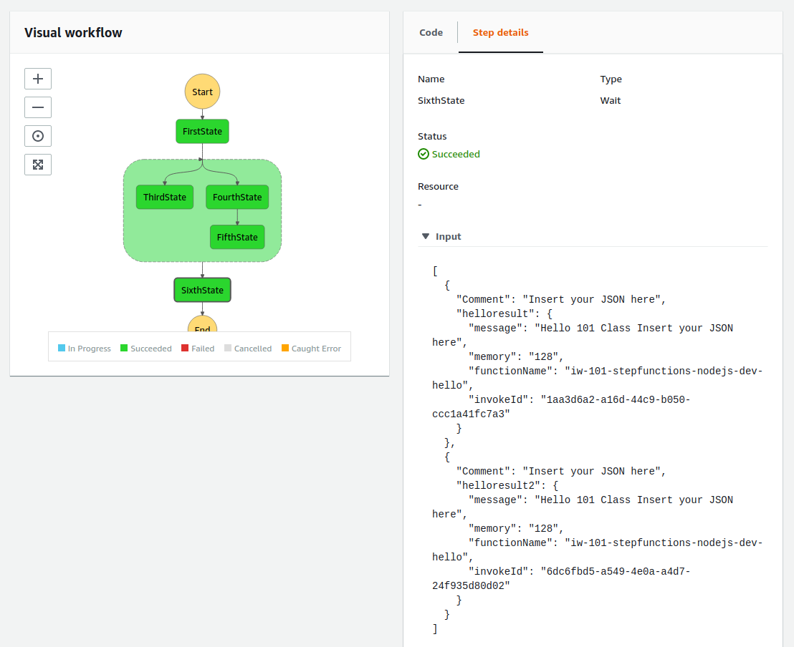

>Note that the outputs of these 2 branches get merged together.

Have you spotted that the Lambda ARNs have a number at the end of them - part of the `deploy` output :

```bash
HelloLambdaFunctionQualifiedArn: arn:aws:lambda:eu-west-1:REDACTED:function:iw-101stepfunctions-dev-hello:5
```

>the `:5` indicated the version number of the Lambda, note that eventually you will run capacity in the region due to the number of versions

Other Lambda Limits : <https://docs.aws.amazon.com/lambda/latest/dg/limits.html>

To fix this, we can disable version creation using `versionFunctions: false`

```yml
provider:
  name: aws
  runtime: nodejs8.10
  stage: dev
  region: eu-west-1
  profile: 101profile
  versionFunctions: false
```

StepFunctions also have limits <https://docs.aws.amazon.com/step-functions/latest/dg/limits.html>

## Next Step Function : 101ChoiceMachine

This `serverless.yml` is the next example [./saved-steps/serverless-06-101-choice-machine.yml](./saved-steps/serverless-06-101-choice-machine.yml)

This machine will use the `Type : Choice` to control the flow based on `inputNum`.

```yml
          SecondState:
            Type: Choice
            Choices:
            - Variable: "$.inputNum"
              NumericEquals: 1
              Next: ThirdState
            - Variable: "$.inputNum"
              NumericGreaterThan: 5
              Next: FourthState
            Default: FifthState
```

There is an `Array` of choice Rules that run in order, in this example we use `NumericEquals` and `NumericGreaterThan`

> There are many more see <https://docs.aws.amazon.com/step-functions/latest/dg/amazon-states-language-choice-state.html>
* And
* BooleanEquals
* Not
* NumericEquals
* NumericGreaterThan
* NumericGreaterThanEquals
* NumericLessThan
* NumericLessThanEquals
* Or
* StringEquals
* StringGreaterThan
* StringGreaterThanEquals
* StringLessThan
* StringLessThanEquals
* TimestampEquals
* TimestampGreaterThan
* TimestampGreaterThanEquals
* TimestampLessThan
* TimestampLessThanEquals

Lets deploy it out

```bash
sls deploy --verbose stage=dev
```

This is how it is rendered.

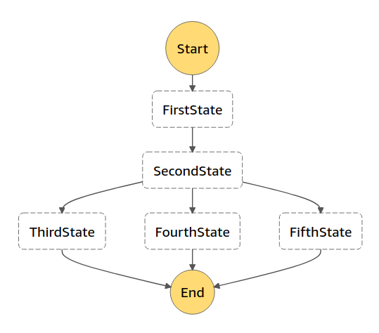

>When we start this execution we must supply JSON with a key/value 

```json
{
  "inputNum": 5
}
```

5 Matches no rules, so we end in the Fifith State

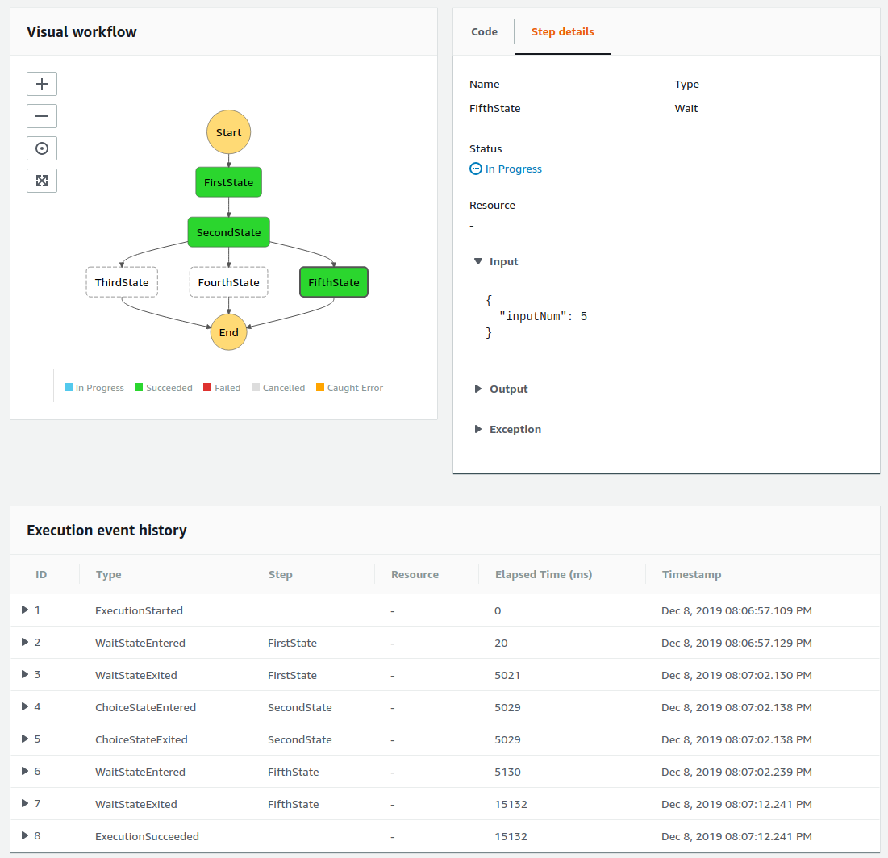

```json
{
  "inputNum": 50
}
```

50 matches the 2nd rule, so we get the Forth State

```yml
            - Variable: "$.inputNum"
              NumericGreaterThan: 5
              Next: FourthState
```

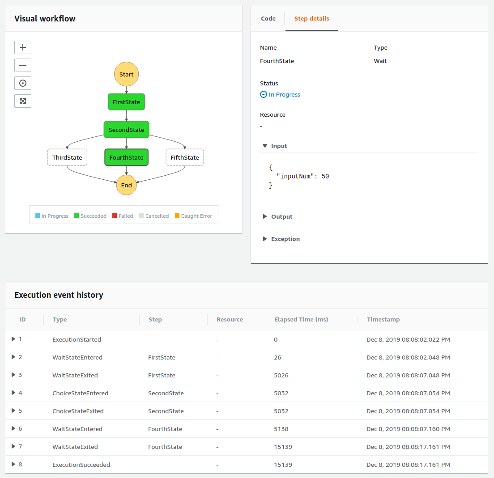

## Clean UP

This will un-deploy all the resources being used in AWS

```bash
sls remove -STAGE=DEV
```
