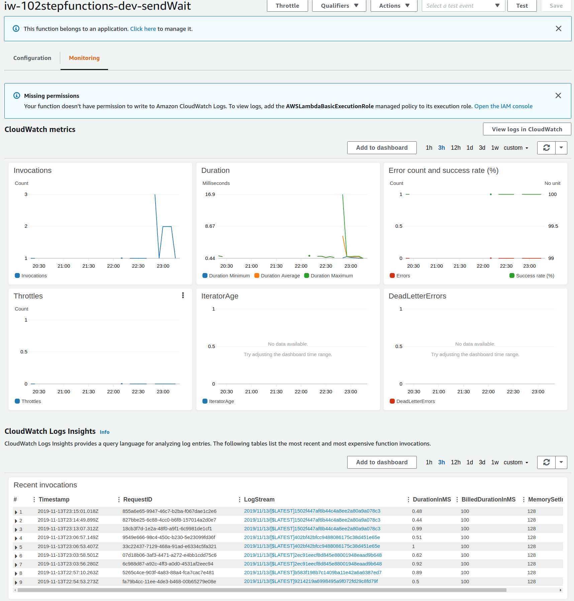
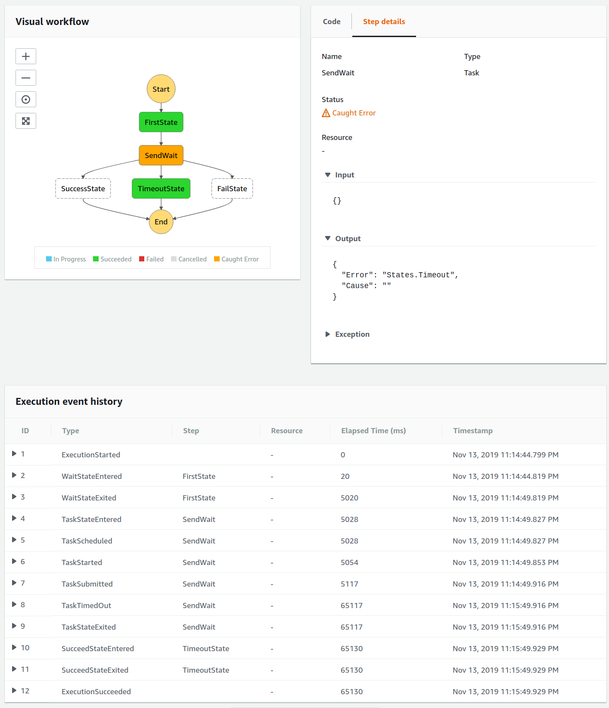
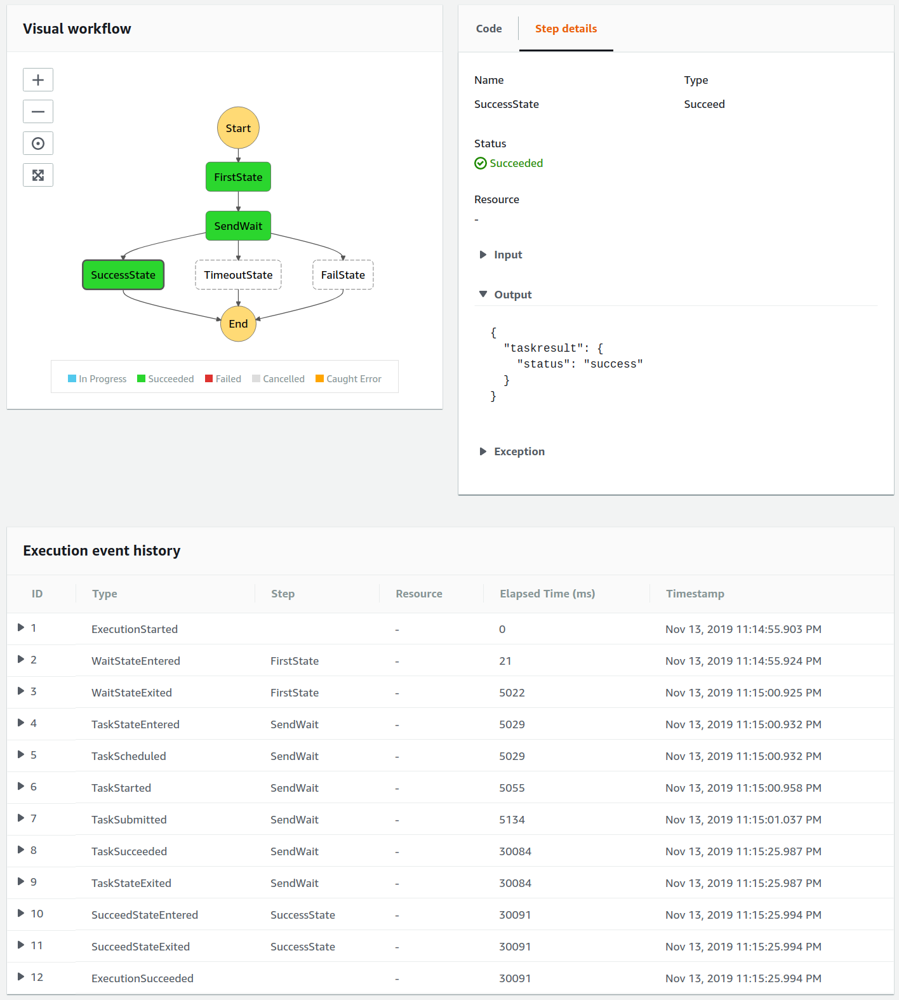

# 102 Step Functions - Infinity Works 

This is the 2nd part of the Step Functions course.
You will need to setup the project by following the setup in the [101 README](../101/README.md)

## Outline

* First Step Machine : iw102StarterMachine
* Add APIs to Step Machine : iw102StarterMachine
* More secure API : iw102StarterMachine
* Callback State Machine : iw102CallbackMachine

### Location of this checked out code

Because this is a go project, it must be checked out (or linked) within your go/src directory.

Copy or Link this project to

`~/go/src/github.com/102-step-functions/`

How to Link it

```bash
mkdir -p ~/go/src/github.com/
mkdir ~/code
cd ~/code
git clone git@github.com:infinityworks/101-Sessions.git
cd ~/go/src/github.com
ln -s ~/code/101-Sessions/sessions/StepFunctions-100/102 102-step-functions
```

## First Step Machine : iw102StarterMachine

Copy the contents of the file : see [./saved-steps/serverless-01-starter.yml](./saved-steps/serverless-01-starter.yml) over the `./serverless.yml` file.

Now we setup deploy the step function:

```bash
npm install
make deploy STAGE=dev
```

> You can Invoke a step function from the CLI

```bash
sls invoke stepf --name iw102StarterMachine --data '{"thekey":"thevalue"}'
```

This runs the stepfunction synchronously 

```bash
{ executionArn: 'arn:aws:states:eu-west-1:000000000000:execution:Iw102StarterMachineStepFunctionsStateMachine-C8ZYXzFB9SCO:0e0eac81-ce53-4db5-aa86-86e92efdeed7',
  stateMachineArn: 'arn:aws:states:eu-west-1:000000000000:stateMachine:Iw102StarterMachineStepFunctionsStateMachine-C8ZYXzFB9SCO',
  name: '0e0eac81-ce53-4db5-aa86-86e92efdeed7',
  status: 'SUCCEEDED',
  startDate: 2019-11-12T11:39:26.081Z,
  stopDate: 2019-11-12T11:39:36.397Z,
  input: '{"thekey":"thevalue"}',
  output: '{"thekey":"thevalue","taskresult":"Hello 102 Class"}' }
```

## Add APIs to Step Machine : iw102StarterMachine

Next we are going to expose an API to allow Step Machines to be started / stoped / described.

Copy the contents of the file : see [./saved-steps/serverless-02-api.yml](./saved-steps/serverless-02-api.yml) over the `./serverless.yml` file.

This actually creates an `API Gateway` deployment.

The `events:` block contains the endpoints you wish to expose.

```yml
stepFunctions:
  stateMachines:
    iw102StarterMachine:
      events:
        - http:
            path: hello
            method: GET
        - http:
            path: action/start
            method: POST
        - http:
            path: action/status
            method: POST
            action: DescribeExecution
        - http:
            path: action/stop
            method: POST
            action: StopExecution
      definition:
```

Run out the changes

```bash
make deploy STAGE=dev
```

We can see that api endpoints get created

```yml
Serverless StepFunctions Outputs
endpoints:
  GET - https://iev7deoka1.execute-api.eu-west-1.amazonaws.com/dev/hello
  POST - https://iev7deoka1.execute-api.eu-west-1.amazonaws.com/dev/action/start
  POST - https://iev7deoka1.execute-api.eu-west-1.amazonaws.com/dev/action/status
  POST - https://iev7deoka1.execute-api.eu-west-1.amazonaws.com/dev/action/stop
```

These can be seen in the console <https://eu-west-1.console.aws.amazon.com/apigateway/home?region=eu-west-1>


You can click `Test` and send a Request Body


This will `asynchronosly` start a step function execution, you can view them at <https://eu-west-1.console.aws.amazon.com/states/home?region=eu-west-1#/statemachines>

You can also use the `DescribeExecution` integration endpoint to see the progress of an execution

Click `Test` and enter a Request Body

```json
{
   "executionArn": "arn:aws:states:eu-west-1:0000000000:execution:Iw102StarterMachineStepFunctionsStateMachine-C8ZYXzFB9SCO:8ff3bddb-4864-4881-943e-2f0055120652"
}
```

This gives this kind of output

```json
{
  "executionArn": "arn:aws:states:eu-west-1:0000000000:execution:Iw102StarterMachineStepFunctionsStateMachine-C8ZYXzFB9SCO:8ff3bddb-4864-4881-943e-2f0055120652",
  "input": "{\"test1\":\"test2\"}",
  "name": "8ff3bddb-4864-4881-943e-2f0055120652",
  "output": "{\"test1\":\"test2\",\"taskresult\":\"Hello 102 Class\"}",
  "startDate": 1573568204.569,
  "stateMachineArn": "arn:aws:states:eu-west-1:00000000000:stateMachine:Iw102StarterMachineStepFunctionsStateMachine-C8ZYXzFB9SCO",
  "status": "SUCCEEDED",
  "stopDate": 1573568214.936
}
```

However we have just exposed an endpoint to the world that anyone can use!

Lets secure it.

## More secure API : iw102StarterMachine

Now lets introduce some keys and usage plans, also note the `private: true` on each event

```yml
provider:
  name: aws
  runtime: go1.x
  stage: dev
  region: eu-west-1
  profile: 101profile
  versionFunctions: false
  apiKeys:
    - ${opt:stage, self:provider.stage}-myFirstKey
  usagePlan:
    quota:
      limit: 5000
      offset: 2
      period: MONTH
    throttle:
      burstLimit: 200
      rateLimit: 100

stepFunctions:
  stateMachines:
    iw102StarterMachine:
      events:
        - http:
            path: hello
            method: GET
            private: true
```

Copy the contents of the file : see [./saved-steps/serverless-03-api-keys.yml](./saved-steps/serverless-03-api-keys.yml) over the `./serverless.yml` file.

And deploy

```bash
make deploy STAGE=dev
```

Now we can see that the output generates a key that is needed to call the service, this key is shown each time and only get generated once.

>You can hide the key from the output with the switch ` --conceal`

```bash
Serverless: Stack update finished...
Service Information
service: iw-102stepfunctions
stage: dev
region: eu-west-1
stack: iw-102stepfunctions-dev
api keys:
  dev-myFirstKey: s1HR9a43llolcatslikeiamdoingthat7YEIvns8
endpoints:
functions:
  hello: iw-102stepfunctions-dev-hello
layers:
  None
```

>The key is also visible in the Web Console <https://eu-west-1.console.aws.amazon.com/apigateway/home?region=eu-west-1#/api-keys/>


You can now see that the API calls require keys, if you try without you get 

```json
{"message":"Forbidden"}
```

Test it - open an ssl connection

```bash
openssl s_client llb348ist9.execute-api.eu-west-1.amazonaws.com:443
```

Send a Request

```bash
GET /dev/hello HTTP/1.1
host: llb348ist9.execute-api.eu-west-1.amazonaws.com
X-API-Key: s1HR9a43llolcatslikeiamdoingthat7YEIvns8
connection: close
```

Get a Response!

```bash
HTTP/1.1 200 OK
Content-Type: application/json
Content-Length: 190
Connection: close
Date: Tue, 12 Nov 2019 15:40:09 GMT
x-amzn-RequestId: 9c3d8aab-83bf-4542-8256-36c9f42b6b01
x-amz-apigw-id: DDXN9HNcDoEF8oA=
X-Amzn-Trace-Id: Root=1-5dcad259-760ded2caa731b642837fea4
X-Cache: Miss from cloudfront
Via: 1.1 f79355bad214d64e02ae8e84a86f4933.cloudfront.net (CloudFront)
X-Amz-Cf-Pop: LHR61-C2
X-Amz-Cf-Id: 6N0AqES_u1GsNM4dzd5ZHITISEfqxCjX2qoVgCw6nwYTjnz5ZTZHiA==

{"executionArn":"arn:aws:states:eu-west-1:386676700885:execution:Iw102StarterMachineStepFunctionsStateMachine-YBD4dm89PhcK:9c3d8aab-83bf-4542-8256-36c9f42b6b01","startDate":1.573573209347E9}closed
```

## Callback State Machine : iw102CallbackMachine

This step machine will stop, generate a wake-up token, and then wait for an external task to use the token to :

* Send a `Success`
* Send a `Failure`
* Send a `Heartbeat`*

> *if you don't set a `HeartbeatSeconds:` then the step function will wait for the whole year

The Task is a special one that can be used to push a message with the token to any of the following services (see <https://github.com/awsdocs/aws-step-functions-developer-guide/blob/master/doc_source/concepts-service-integrations.md>)

* AWS Lambda
* AWS Batch
* AWS ECS/Fargate
* SNS
* SQS
* Step Functions!

In this example we call a `Lambda` named `sendWait` to tell it the token to wake us up with.

In a longer example we could Email or SMS this out to a customer as a one-use URL.

```yml
          SendWait:
            Type: Task
            Resource: "arn:aws:states:::lambda:invoke.waitForTaskToken"
            HeartbeatSeconds: 60
            Parameters:
              FunctionName: iw-102stepfunctions-${opt:stage, self:provider.stage}-sendWait
              Payload: 
                message: "Please use this token to wake up this Step Function Execution"
                token.$: "$$.Task.Token"
            Catch:
            - ErrorEquals:
              - States.Timeout
              Next : TimeoutState
            - ErrorEquals:
              - States.TaskFailed
              Next : FailState
            Next: SuccessState
            ResultPath: "$.taskresult"
```

Lets deploy this out.

Copy the contents of the file : see [./saved-steps/serverless-04-callback.yml](./saved-steps/serverless-04-callback.yml) over the `./serverless.yml` file.

And deploy

```bash
make deploy STAGE=dev
```

You should see the new state machine <https://eu-west-1.console.aws.amazon.com/states/home?region=eu-west-1#/statemachines>

> Note that the `GET` API call has moved to share the context with the `POST` API at `/action/start`


Once one of these is waiting the result can be :

* Success
* Timeout
* Failure

We can now hit the API to start one of the executions

```bash
openssl s_client llb348ist9.execute-api.eu-west-1.amazonaws.com:443
```

Then paste in
> Note you need to have 2 returns after the `close`

```bash
GET /dev/action/start HTTP/1.1
host: llb348ist9.execute-api.eu-west-1.amazonaws.com
X-API-Key: s1HR9a43llolcatslikeiamdoingthat7YEIvns8
connection: close

```

An Execution should now be running, and if you look at the execution, you should see the Token getting passed to the Lambda


If you see the `sendWait Lambda` <https://eu-west-1.console.aws.amazon.com/lambda/home?region=eu-west-1#/functions/iw-102stepfunctions-dev-sendWait?> it recieves the token and writes it to log (Cloudwatch)



```go
package main

import (
	"context"
	"fmt"

	"github.com/aws/aws-lambda-go/lambda"
)

// WaitEvent an event to make the token accessible
type WaitEvent struct {
	Token string `json:"token"`
}

// HandleRequest the method that recieves the step call
func HandleRequest(ctx context.Context, waitEvent WaitEvent) (string, error) {
	fmt.Printf("Waiting for token (logged to cloudwatch) %v", waitEvent.Token)
	// This could email out this token as a URL to click on in an Email.
	return fmt.Sprintf("Waiting for token %v", waitEvent.Token), nil
}

func main() {
	lambda.Start(HandleRequest)
}
```

You can click in the `Monitoring` tab in the Lambda and then click the `View logs in CloudWatch` button.

If you pick the newest logstream, you can see the Lambda printing out the token.


By now this execution will  have `timed out`, in our state machine this is caught and treated as a `SUCCESS`

```yml
            Catch:
            - ErrorEquals:
              - States.Timeout
              Next : TimeoutState
```




However `when the execution is waiting for a callback`, we can hit the AWS API with

* send-task-success
* send-task-failure
* send-task-heartbeat

First lets set our timeout to be `5 minutes`, to give ourselves more time to work

```yaml
          SendWait:
            Type: Task
            Resource: "arn:aws:states:::lambda:invoke.waitForTaskToken"
            HeartbeatSeconds: 300
            Parameters:
```

And re-deploy

```bash
make deploy STAGE=dev
```

Great, now lets start another execution

```bash
openssl s_client llb348ist9.execute-api.eu-west-1.amazonaws.com:443
```

Then paste in

```bash
GET /dev/action/start HTTP/1.1
host: llb348ist9.execute-api.eu-west-1.amazonaws.com
X-API-Key: s1HR9a43llolcatslikeiamdoingthat7YEIvns8
connection: close

```

Ok we need to grab the `token` from either the `step machine execution` or the `lambda log`

Then we export is as `${token}` variable in our shell

```bash
export token=AAAAKgAAAAIAAAAAAAAAAXH1adiaFSjaEB5xg48ruVvjRhI3yJ7Hxnitg8FAVFxDblKIDE6ql4ZsRru+zCDMGFCM5qHefmQXfK2m6lsqzuIU4EUa7iuqxuLYzyA2LBJTUlAClKFSXqbzmsdNP8uS8M1NMp1V82sp4VvigJ1iAA8m+36L1InskdR/vFGP1pSXn1vgO4EjlniCc9ATFQc3F+0rWi0/GCpQ8TK20+CitVv8uIPxccA/H3K5uk690bfBX0fOkf/ecIztIGXo0jhw/inEHrt7lenV0i1eYZX5OXQpqw/lPxW3KKDYNa3mOMBzd4GJwi7gWKvGiI4tr8inzDoSl7Arp4FfXvAjSuEM+qYUlu5VhmoWYUq0SG2Nsy+AzmZo/CD+O94LgutB/bH6Fiys3Jbk0aT8vQ8PAjm8DhmlXGNFyJJMX00p2kyK35CV+F932ViSE7vXXKz7PZsVqBdpUG+oDM1Ue4poSG6hBAT2I8EevcKddqbu921OhimYZLDGFTgq/ykvMpoyHMVwQBAVqzPuEGw2QCRGhUBU3YEj06tze8RR1p0fo4VcwLC+51P7n94XlonuqlKFxVVVtJJzw7hDbnAPm6qmc+NKG0AIIIwrAvc+Po2fqB9gqieNjI5DoGt43EXvI9UaeHL0s6AGCvXsHMe4QtM73O9ByEacMEYY5w6B7qk59ivte0Gv3VuwDjd1qkTg3WqjXnxLNg==
```

Now we can use the `awscli` to send the callback events

This command sends a `heartbeat`, which will re-set the timeout back to `300 seconds`

```bash
aws stepfunctions send-task-heartbeat --task-token $token --profile 101profile --region eu-west-1
```

Ok lets make this execution `succeed`, and use this command

```bash
aws stepfunctions send-task-success --task-token $token --task-output '{"status": "success"}' --profile 101profile --region eu-west-1
```



```bash
aws stepfunctions send-task-failure --task-token $token --profile 101profile --region eu-west-1
```

Now lets start another execution to test `FAILURES`

```bash
openssl s_client llb348ist9.execute-api.eu-west-1.amazonaws.com:443
```

Then paste in

```bash
GET /dev/action/start HTTP/1.1
host: llb348ist9.execute-api.eu-west-1.amazonaws.com
X-API-Key: s1HR9a43llolcatslikeiamdoingthat7YEIvns8
connection: close

```

Now we must get the `${token}` again and export it

```bash
export token=AAAAKgAAAAIAAAAAAAAAAXH1adiaFSjaEB5xg48ruVvjRhI3yJ7Hxnitg8FAVFxDblKIDE6ql4ZsRru+zCDMGFCM5qHefmQXfK2m6lsqzuIU4EUa7iuqxuLYzyA2LBJTUlAClKFSXqbzmsdNP8uS8M1NMp1V82sp4VvigJ1iAA8m+36L1InskdR/vFGP1pSXn1vgO4EjlniCc9ATFQc3F+0rWi0/GCpQ8TK20+CitVv8uIPxccA/H3K5uk690bfBX0fOkf/ecIztIGXo0jhw/inEHrt7lenV0i1eYZX5OXQpqw/lPxW3KKDYNa3mOMBzd4GJwi7gWKvGiI4tr8inzDoSl7Arp4FfXvAjSuEM+qYUlu5VhmoWYUq0SG2Nsy+AzmZo/CD+O94LgutB/bH6Fiys3Jbk0aT8vQ8PAjm8DhmlXGNFyJJMX00p2kyK35CV+F932ViSE7vXXKz7PZsVqBdpUG+oDM1Ue4poSG6hBAT2I8EevcKddqbu921OhimYZLDGFTgq/ykvMpoyHMVwQBAVqzPuEGw2QCRGhUBU3YEj06tze8RR1p0fo4VcwLC+51P7n94XlonuqlKFxVVVtJJzw7hDbnAPm6qmc+NKG0AIIIwrAvc+Po2fqB9gqieNjI5DoGt43EXvI9UaeHL0s6AGCvXsHMe4QtM73O9ByEacMEYY5w6B7qk59ivte0Gv3VuwDjd1qkTg3WqjXnxLNg==
```

And now we can force this one to `Fail`

```bash
aws stepfunctions send-task-heartbeat --task-token $token --profile 101profile --region eu-west-1
```


## CloudWatch Notifications

You can monitor the execution state of your state machines via CloudWatch Events. It allows you to be alerted when the status of your state machine changes to `ABORTED`, `FAILED`, `RUNNING`, `SUCCEEDED` or `TIMED_OUT`.

```yml
stepFunctions:
  stateMachines:
    hellostepfunc1:
      name: test
      definition:
        ...
      notifications:
        ABORTED:
          - sns: SNS_TOPIC_ARN
          - sqs: SQS_TOPIC_ARN
          - sqs: # for FIFO queues, which requires you to configure the message group ID
              arn: SQS_TOPIC_ARN
              messageGroupId: 12345
          - lambda: LAMBDA_FUNCTION_ARN
          - kinesis: KINESIS_STREAM_ARN
          - kinesis:
               arn: KINESIS_STREAM_ARN
               partitionKeyPath: $.id # used to choose the parition key from payload
          - firehose: FIREHOSE_STREAM_ARN
          - stepFunctions: STATE_MACHINE_ARN
        FAILED:
```


## Clean UP

This will un-deploy all the resources being used in AWS

```bash
sls remove -STAGE=DEV
```