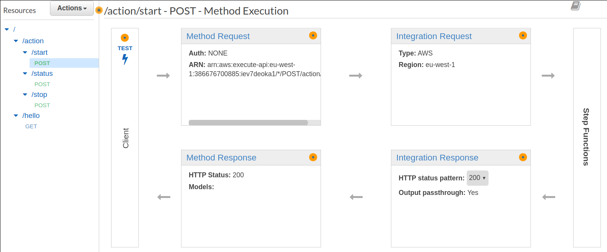
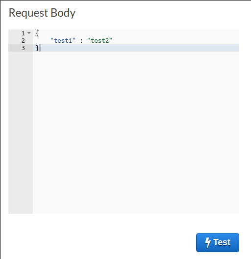

# 102 Step Functions - Infinity Works 

This is the 2nd part of the Step Functions course.
You will need to setup the project by following the setup in the [101 README](../101/README.md)

## Outline

* First Step Machine : iw102StarterMachine
* add APIs to Step Machine : iw102StarterMachine

### Location of this checked out code

Because this is a go project, it must be checked out (or linked) within your go/src directory.

Copy or Link this project to

`~/go/src/github.com/102-step-functions/`

How to Link it

```bash
mkdir -p ~/go/src/github.com/
mkdir ~/code
cd ~/code
git clone git@github.com:infinityworks/101-Sessions.git
cd ~/go/src/github.com
ln -s ~/code/101-Sessions/sessions/StepFunctions-100/102 102-step-functions
```

## First Step Machine : iw102StarterMachine

Copy the contents of the file : see [./saved-steps/serverless-01-starter.yml](./saved-steps/serverless-01-starter.yml) over the `./serverless.yml` file.

Now we setup deploy the step function:

```bash
npm install
make deploy STAGE=dev
```

> You can Invoke a step function from the CLI

```bash
sls invoke stepf --name iw102StarterMachine --data '{"thekey":"thevalue"}'
```

This runs the stepfunction synchronously 

```json
{ executionArn: 'arn:aws:states:eu-west-1:000000000000:execution:Iw102StarterMachineStepFunctionsStateMachine-C8ZYXzFB9SCO:0e0eac81-ce53-4db5-aa86-86e92efdeed7',
  stateMachineArn: 'arn:aws:states:eu-west-1:000000000000:stateMachine:Iw102StarterMachineStepFunctionsStateMachine-C8ZYXzFB9SCO',
  name: '0e0eac81-ce53-4db5-aa86-86e92efdeed7',
  status: 'SUCCEEDED',
  startDate: 2019-11-12T11:39:26.081Z,
  stopDate: 2019-11-12T11:39:36.397Z,
  input: '{"thekey":"thevalue"}',
  output: '{"thekey":"thevalue","taskresult":"Hello 102 Class"}' }
```

## add APIs to Step Machine : iw102StarterMachine

Next we are going to expose an API to allow Step Machines to be started / stoped / described.

Copy the contents of the file : see [./saved-steps/serverless-02-api.yml](./saved-steps/serverless-02-api.yml) over the `./serverless.yml` file.

This actually creates an `API Gateway` deployment.

The `events:` block contains the endpoints you wish to expose.

```yml
stepFunctions:
  stateMachines:
    iw102StarterMachine:
      events:
        - http:
            path: hello
            method: GET
        - http:
            path: action/start
            method: POST
        - http:
            path: action/status
            method: POST
            action: DescribeExecution
        - http:
            path: action/stop
            method: POST
            action: StopExecution
      definition:
```

Run out the chnages

```bash
make deploy STAGE=dev
```

```yml
Serverless StepFunctions OutPuts
endpoints:
  GET - https://iev7deoka1.execute-api.eu-west-1.amazonaws.com/dev/hello
  POST - https://iev7deoka1.execute-api.eu-west-1.amazonaws.com/dev/action/start
  POST - https://iev7deoka1.execute-api.eu-west-1.amazonaws.com/dev/action/status
  POST - https://iev7deoka1.execute-api.eu-west-1.amazonaws.com/dev/action/stop
```

These can be seen in the console <https://eu-west-1.console.aws.amazon.com/apigateway/home?region=eu-west-1>



You can click `Test` and send a Request Body



This will asynchronosly start a step function execution, you can view them at <https://eu-west-1.console.aws.amazon.com/states/home?region=eu-west-1#/statemachines>

You can also use the DescribeExecution integration endpoint to see the progress of an execution

Click `Test` and enter a Request Body

```json
{
   "executionArn": "arn:aws:states:eu-west-1:0000000000:execution:Iw102StarterMachineStepFunctionsStateMachine-C8ZYXzFB9SCO:8ff3bddb-4864-4881-943e-2f0055120652"
}
```

This gives this kind of output

```json
{
  "executionArn": "arn:aws:states:eu-west-1:0000000000:execution:Iw102StarterMachineStepFunctionsStateMachine-C8ZYXzFB9SCO:8ff3bddb-4864-4881-943e-2f0055120652",
  "input": "{\"test1\":\"test2\"}",
  "name": "8ff3bddb-4864-4881-943e-2f0055120652",
  "output": "{\"test1\":\"test2\",\"taskresult\":\"Hello 102 Class\"}",
  "startDate": 1573568204.569,
  "stateMachineArn": "arn:aws:states:eu-west-1:00000000000:stateMachine:Iw102StarterMachineStepFunctionsStateMachine-C8ZYXzFB9SCO",
  "status": "SUCCEEDED",
  "stopDate": 1573568214.936
}
```

However we have just exposed an endpoint to the world that anyone can use!

Lets secure it.

## CloudWatch Notifications

You can monitor the execution state of your state machines via CloudWatch Events. It allows you to be alerted when the status of your state machine changes to `ABORTED`, `FAILED`, `RUNNING`, `SUCCEEDED` or `TIMED_OUT`.

```yml
stepFunctions:
  stateMachines:
    hellostepfunc1:
      name: test
      definition:
        ...
      notifications:
        ABORTED:
          - sns: SNS_TOPIC_ARN
          - sqs: SQS_TOPIC_ARN
          - sqs: # for FIFO queues, which requires you to configure the message group ID
              arn: SQS_TOPIC_ARN
              messageGroupId: 12345
          - lambda: LAMBDA_FUNCTION_ARN
          - kinesis: KINESIS_STREAM_ARN
          - kinesis:
               arn: KINESIS_STREAM_ARN
               partitionKeyPath: $.id # used to choose the parition key from payload
          - firehose: FIREHOSE_STREAM_ARN
          - stepFunctions: STATE_MACHINE_ARN
        FAILED:
```


## Clean UP

This will un-deploy all the resources being used in AWS

```bash
sls remove -STAGE=DEV
```